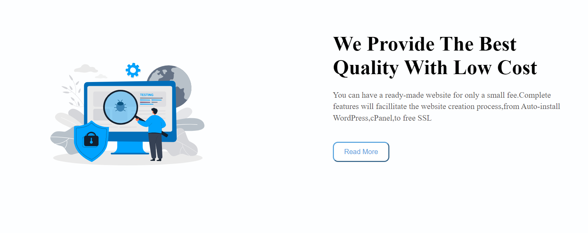
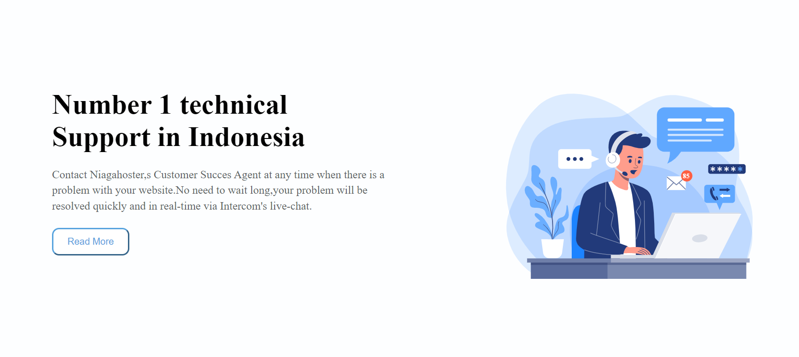

# Project11(HTML & CSS)

# Learnings from this project:

- Gained indepth knowledge about writing proper html code.

- Learnt about Flexbox indepth

- Learnt about Font Awesome icons

## Time taken: 8 hours

# Web Page: [Live-Link](https://projects11-htmlcss.netlify.app/)

